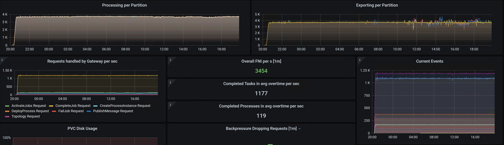
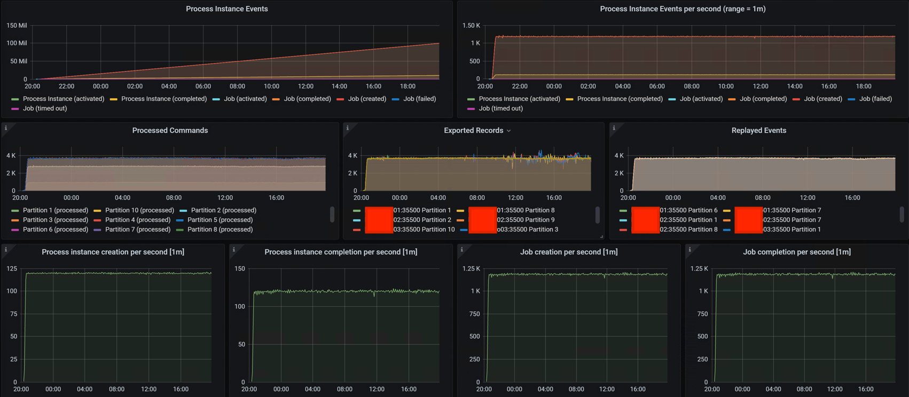
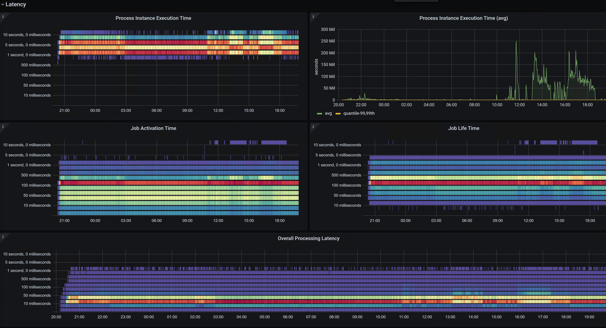
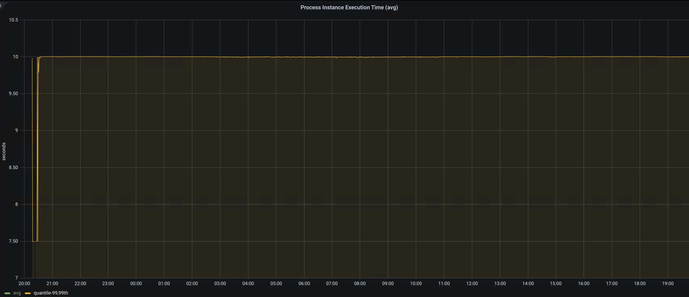
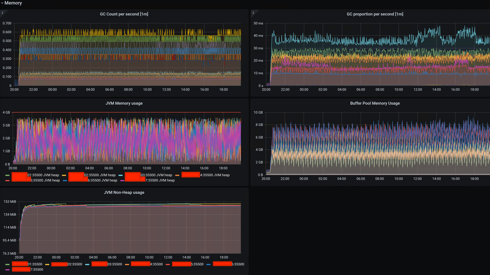

# Performance
In this note, I will share some advice and observations about performance in Zeebe. I have complications finding some sort of short guide about what you need to do to achieve high throughput, low latency, etc. in one place, so I decided to write my own.

TL; DR: If you want you can go straight to [the recommendations](#what-do-i-have-to-do).

## Safe Harbour
[See](../README.md#safe-harbour).

## Show me your numbers
Well, in my attempt to not disclose something sensible, I redmarked our hostnames, etc., but in everything else our numbers are next.
Also, we are using kind of old dashboards (from the 1.2 version, I believe), we will update it soon (after migrating to 8.2, later about it).
1. Our General numbers right now:
   
2. Our throughput numbers:
   
3. Our latency numbers:
   
   1. Let's focus more on process instances latency in 99.99% quantile (note, that by default it is 99% quantile, but we need extra accuracy, [later about it](#show-me-your-environment)).
      
4. Our memory numbers (you will get why do I show you it later):
   

So, of course, there are a lot of different dashboards, metrics, etc. but I focus on that (for our case in my opinion matters most).
Also, I want to say, that this is a peak that we reach right now and for our plans. I believe that there aren't maximum numbers of Zeebe, I think that you could reach more if you fix the current weak spots (later about it).

## Show me your environment
1. We are not in the K8S environment right now (but we have plans to migrate there).
   1. We are running our Docker containers via Ansible + Systemd services.
2. Our typical machine for a Zeebe Cluster has the following resources:
   1. 16 Gb RAM
   2. 12 CPU cores
   3. 50 Gb of the fast SSD drive
   4. RHEL OS
3. In this machine lives one Zeebe Broker and one Zeebe Gateway
   1. We have 10 partitions in our cluster right now.
   2. The replication factor is 3 right now
   3. 5 threads for CPU thread count, and 2 threads for I/O
   4. We are using a custom version of Zeebe 8.0.13 + [this fix](https://github.com/camunda/zeebe/issues/12416)
   5. Also, we protect [Zeebe Gateway API with Keycloak](https://github.com/camunda-community-hub/zeebe-keycloak-interceptor)
   6. We are using the Elasticsearch Exporter
4. Our workers are living in the container orchestration system (I can't disclose this).
   1. Typical requirements for a Docker container are the following:
      1. 0.3 CPU cores
      2. 900 Mb RAM
   2. We are using [Coworker](https://github.com/camunda-community-hub/kotlin-coworker) in our workers
      1. Every worker contains a call to the external system (Web Service or REST API)
         1. This call is asynchronous and reactive using the Kotlin Coroutine bridge to the Reactor
      2. You can guess - we are writing our worker's code with Kotlin
   3. There are three instances of a single application with workers
   4. There are about thirty applications with workers and up to 150 coworker instances at all.
5. In our business goals most of the processes live about tens of seconds because there are user's HTTP requests.
   1. We have a requirement that we should have 99.99% processes below tens of seconds and success.

Without disclosing anything sensitive this is it. If you have a question, you can create an issue or start a new discussion on this repo.

## What do I have to do?

Alright, you are happy with our numbers, but you have a question: how can I reach it? Let's start with answers. I will sort the answers from gaining more performance, to less, but keep in mind - that you should think about these recommendations in a **complex** way.

### Metrics
Yes, without good observations you will try to tune your system blindly with much-much less chance of success. Set up all metrics that you can, period. 

### Workers
TL; DR: Play with the amount of threads + CPUs + Max Jobs for activation for your worker, but is better to migrate to [the reactive workers](https://github.com/camunda-community-hub/kotlin-coworker). Do not try to create an async job inside your worker.

Well, workers are a first, most suffered weak spot because:
If you are in the Greenfield stack and using Spring Zeebe you have, by default a single thread for your workers in your app (configurable). If you are not doing some non-blocking calculations, and calling some Web Service, REST APIs, databases, etc. and you are blocking this thread - you are screwed:
1. By default, your worker tries to take 24 jobs in parallel (configurable), but with this single thread executor. So, if you are blocking this thread - other 23 (and I speak about one worker, if you have several workers in your app here is the formula: 24 - 1 + 24 * amount of workers in your app)
2. Also, long story short, the same executor tries to schedule the next poll for jobs in your worker. If the thread was blocked - then the poll happens later.

So, now you have two options:
1. Relatively fast, but may not work for you: play with the amount of threads, max jobs for activation, CPUs, other thread pools, etc.
2. The better way - migrate to [the Coworker](https://github.com/camunda-community-hub/kotlin-coworker)

:warning: I should warn you to not use Kotlin Coroutines, Reactor, or other async, and or reactive frameworks with Spring Zeebe. Yes, it works fast. BUT: if you do so, you will **break your brakes**. It means: your worker will try to get **all jobs** that exist **without limits**. This will lead to:
1. Unequal loads between your application with workers (one will try to take all the jobs when others will be less loaded).
2. In case that there are a tremendous amount of jobs: your worker eventually will fall (OOM, or more likely GC will take all CPU, and your container orchestrator kill the pod because it will not respond to the actuator/health).

So, yes, if you are using Reactor/Coroutines/etc. your workers with Spring Zeebe will work at light speed, but in case of an emergency - you can't restore them.
If you are interested in this topic I can create a separate speech/article.

### Zeebe Cluster
TL; DR: Our worst enemy was a GC and underestimation about memory. So, use a low pause GC with a fixed heap with a proper amount of memory.

In our case, we were suffering from cluster rebalancing all of a sudden. We saw that this was correlated with GC pauses.

#### Zeebe Broker Container
1. Set up static resources. You are already doing this if you are in a K8S environment or so, but if you don't - limit the CPU and memory.
2. Disable SWAP. Yes, if you don't have enough memory you could use a disk. This is pretty bad because could lead to long responses and cluster rebalancing.
3. Give the container enough memory. Our formula is next: (heap + number of partitions * segment size (by default it is 128 Mb) * load factor) * 1.3 (30% for spikes, other parts of mem, etc.).
   1. What is a load factor? It depends on your load (obviously). In our environment, after several tests, we find out that most of the time three segments are active on the most loaded node. You can try with different positive numbers, but a bigger number is better.
   2. What if you assign less memory? Well, it depends. The main problem is if you do not fix and preallocate the heap size (more about this later) at some point in the time segments (they are Memory Mapped Files) start to clash with heap additional allocations.

#### Zeebe Broker JVM

As I already said our main theory was next: we were getting a huge G1GC pause on the Old Gen, while we are cleaning the garbage (it took seconds actually). But recommendations in this topic are closely connected with [the container optimizations](#zeebe-broker-container) and I strongly advise you to take it all together.

1. Fix the heap
   1. Note, that this is possible since 8.0.14, 8.1.11, 8.2.3, etc. See the labels [here](https://github.com/camunda/zeebe/issues/12416).
   2. Set the `-Xms` equal value that `-Xmx`. We are using 4000 Mb for the heap, so: `-Xms4000m -Xmx4000m`
2. Preallocate the heap. We are doing it so as never to ask OS about more memory in the heap and not clash with segments. Just add `-XX:+AlwaysPreTouch` to `JAVA_OPTS`.
3. Use low pause GC. We decided to use Shenandoah GC because it has several degradation phases before Full GC which (hopefully) will help us someday. Add more to the `JAVA_OPTS`: `-XX:+UseShenandoahGC`

So, our final JAVA_OPTS environment variable value is next: `-Xmx4000m -Xms4000m -XX:+AlwaysPreTouch -XX:+UseShenandoahGC`.
This give less than a millisecond pauses, so we could forget about GC for a long time.

#### Linux under Zeebe Broker
Disable Transparent Huge Pages for the Linux. See [more](https://www.pingcap.com/blog/transparent-huge-pages-why-we-disable-it-for-databases/). 

## Current Bottlenecks
Right now we have a problem with our Elasticsearch cluster (our hypothesis). If we increase our load to 1/8 cluster start to suffer. This suffering correlates with Elasticsearch responses that take quite a long time. We aren't sure if there problem with Elastic, Actor in Zeebe, or something less, so we continue to investigate.

## Plans
1. Update Zeebe to the fresh 8.2 version (more likely to 8.2.4).
2. Enable and set up the Actor metrics.
3. Optimize Elasticsearch